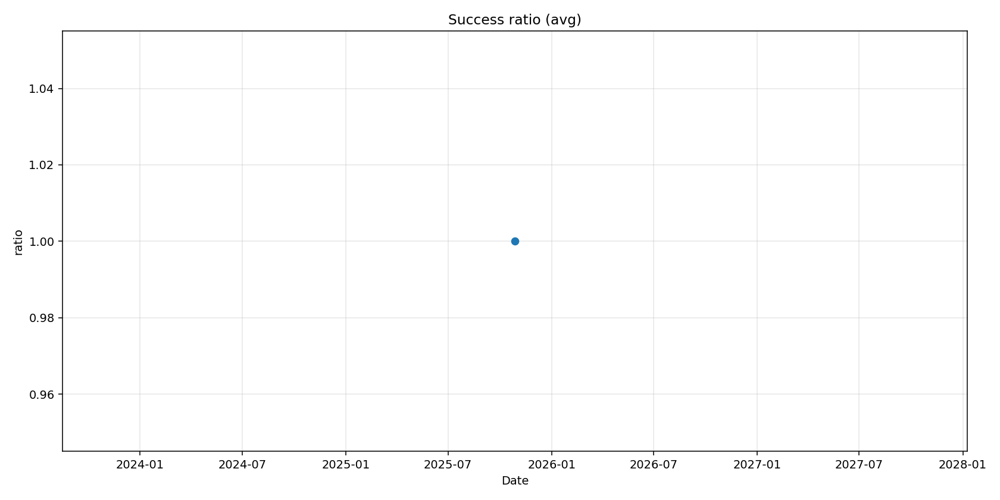

# Skywire Vital Report

**Last measurement: 2025-10-28**

## Daily Summary
- **Success ratio** : 100.00% (· –)
- **Latency avg** : – ms (· –)
- **Nodes active (est.)** : – (· –)
- **Proxy activity (tx)** : – (· –)

## Charts

> Auto-generated by **Sigma – Skywire Vital Report**.